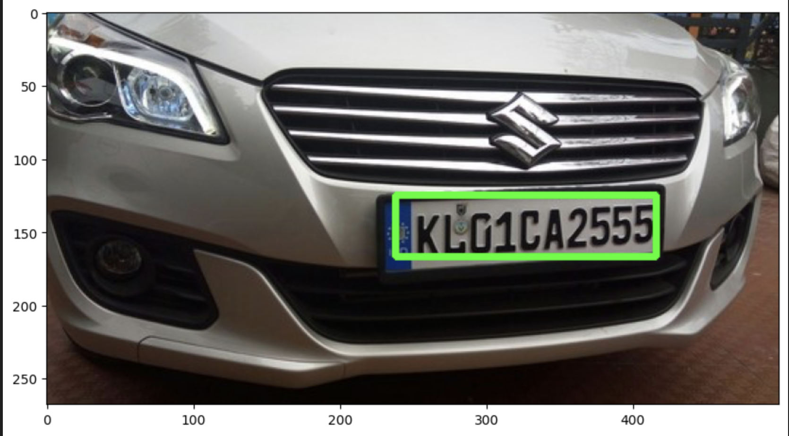
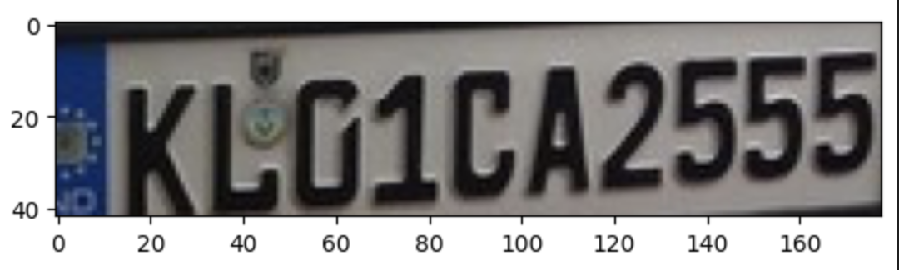
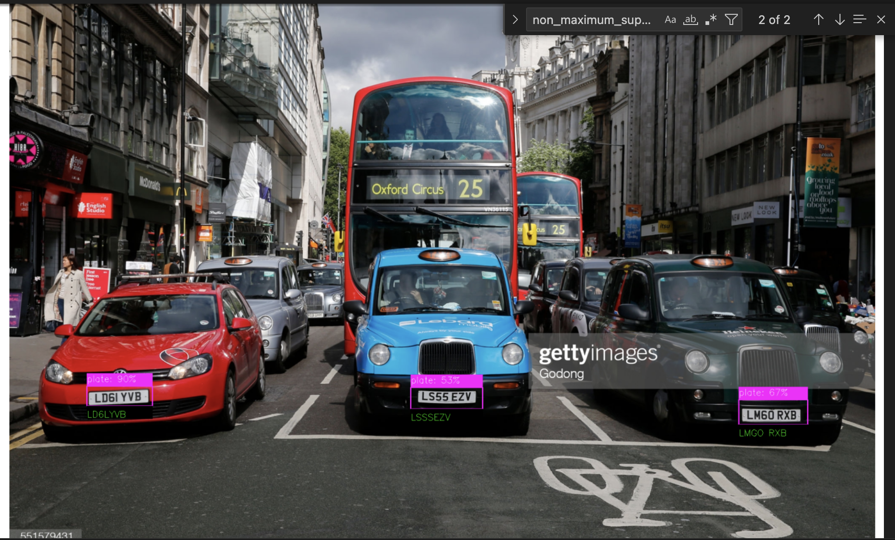

# Car license plate number detection

Car plate lincense number detection model is used to detect the car license plate and extract the car plate license.

There are two implementation used to detect the car plate license number:

1. Tensor Flow
2. Yolo

The below are the data preprocesing step done:

### Data Collection
1. Collect the sample of images to be trained
2. We can use Roboflow or we can have our own images for training the model.

### Labelling
1. [Label Studio](https://github.com/HumanSignal/label-studio) to label the data with bounding box for object detection
2. Export the labelled data with Pascal VOC format.


## Tensorflow implementation

### Data Pre Processing
1. Using LXML to convert the XMl to CSV format combining the metadata from pascal VOC xml with the images in       structyred format.
2. Pandas dataframe to insert the csv records to dataframe.
3. Structure the images to standard size.
4. Convert the images to Numpy array
5. Normalize the structured images arrays and labels
6. Split the train and test set with 80% of train set and 20% of test set.

### Training the model
1. Taining the model using imagenet(InceptionResNetV2 )
The below is the neural netwwork configuration used:

```
inception_resnet = InceptionResNetV2(weights="imagenet",include_top=False,input_tensor=Input(shape=(224,224,3)))
inception_resnet.trainable=False
inception_model_input= inception_resnet.input
inception_model_output = inception_resnet.output
inception_model_output = Flatten()(inception_model_output)
inception_model_output = Dense(500,  activation="relu")(inception_model_output)
inception_model_output = Dense(250,  activation="relu")(inception_model_output)
inception_model_output = Dense(4, activation="sigmoid")(inception_model_output)
```

2. Training the model will create .keras model
3. Using the model to detect the bounding box for the car lincense plate.

4. Get the Region of interest(ROI) of the bounding box using the co-ordinate and extract the text using OCR

5. The below are the methods that are used for OCR:
  a. EasyOCR
  b. Pytesseract
  c. LLM Models
    i. gpt-4.1-mini
    ii. mistral-small-2503
    iii. Phi-4-multimodal-instruct
6. The trained model can be used to detect the car plate license and also extract the car lincense plate usign OCR in images and real time video.

### Web Application:
  The web application was built using flask. For the above training model,  the trained model is used to detect the car license plate and generate a bounding box over it and extract the text.

## Yolo Implementation

### Data Pre Processing
1. Using LXML to convert the XMl to CSV format combining the metadata from pascal VOC xml with the images in       structyred format.
2. Pandas dataframe to insert the csv records to dataframe.
3. Extract the width and  height of the image , filename , x-coorninate of the bounding box, y-co-ordinate of the bounding box , width and height of the bounding box.
4. Split the train and test set with 80% of train set and 20% of test set.

### Training the model
1. Using ultralytics Yolo11 model will be used for training.
2. The below is the yolo configuration that is used for trianing

```
   results = model.train(
    data="data.yaml",
    epochs=60,          # Increase epochs (CPU is slow, but you need more iterations on small data)
    batch=8,             # Lower batch size, CPU RAM-friendly
    device="cpu",        # Force CPU
    project="model",
    name="v1",
)
```
3. Step to will generate the trained model in .pt format
4. Export the model to ONNX(Open Neural Network Exchange) format as it acts as a universal bridge between different frameworks like TensorFlow, PyTorch, Keras, MXNet, and deployment engines like OpenCV, TensorRT, or ONNX Runtime.
5.  ONNX models are:
    i. Optimized for inference (smaller, faster)
    ii. Precompiled with graph-level optimizations (operator fusion, quantization, etc.)
        Great for real-time applications like object detection, video analytics, or edge devices.
    iii. Training frameworks evolve (YOLOv8 → YOLOv12, TF 2.x → TF 3.x), but ONNX provides a stable intermediate representation that keeps your trained model usable in the long term.

### Model prediction
  1. Load the ONN model using `cv2.dnn.readNetFromONNX`
  2. In order to get prediction from model created via Yolo model need to convert o blob using `cv2.dnn.blobFromImage`
  3. Using NON Maximum Supression(NMS) to supress Yolo to create multiple bounding in the same region(limitation of Yolo model.)
  4. Using `metaplotlib` or `cv2` for car plate license plate detection for image.
   5. Realtime video can also be used to detect car number plate detection.




Reference: https://colab.research.google.com/drive/1BR1uekwjcxTF9J6vNROREbkuhjjozAD2

NB: Please note that the model files will not be uplaoded to the github. Please retun the Jupyter notebook files to generated the model.
